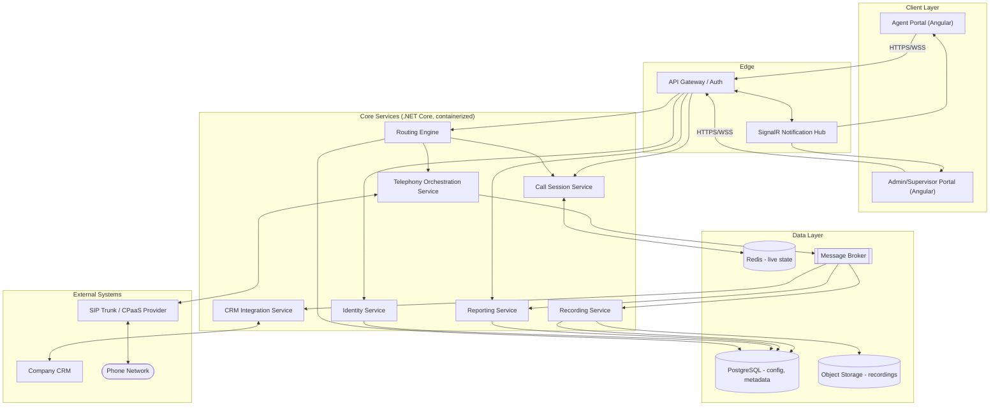

# System Design

## 1. High-Level Components

| Component | Responsibility |
|---|---|
| **Agent Portal (Angular SPA)** | Agent-facing UI: login, status, call controls, screen-pop, notes |
| **Admin/Supervisor Portal (Angular SPA)** | Config UI: users, routing, IVR, live dashboard, reports |
| **API Gateway** | Single entry point, auth, routing to backend services, rate limiting |
| **Identity Service (.NET Core)** | Auth (OIDC/JWT), RBAC (Agent/Supervisor/Admin) |
| **Telephony Orchestration Service (.NET Core)** | Talks to the SIP trunk/CPaaS provider; call setup/teardown, hold/transfer/conference control |
| **Routing Engine (.NET Core)** | Applies IVR + skill/queue rules to decide where a call goes |
| **Call Session Service (.NET Core)** | Tracks live call state (who's on what call, queue position) — real-time, in-memory + Redis |
| **CRM Integration Service (.NET Core)** | Number lookup, screen-pop data, write-back of call outcomes |
| **Recording Service (.NET Core)** | Captures, stores, and indexes call recordings |
| **Reporting Service (.NET Core)** | Aggregates historical data for dashboards/exports |
| **Notification Hub (SignalR)** | Pushes real-time events to agent/supervisor UIs (incoming call, queue updates) |
| **Message Broker (e.g., RabbitMQ/Azure Service Bus)** | Decouples services — call events, CRM sync events, recording-ready events |
| **Primary Database (PostgreSQL/SQL Server)** | Users, routing config, call metadata, CRM sync log |
| **Cache/Session Store (Redis)** | Live agent status, queue state, session data |
| **Object Storage (S3/Azure Blob)** | Call recording files |
| **Telephony Provider (SIP trunk / CPaaS)** | The actual carrier connectivity — inbound/outbound PSTN calls, media handling |
| **External CRM** | System of record for customers, reached via its API |

## 2. Architecture Diagram

*(Rendered live from a prototype/whiteboard during the interview if Mermaid isn't supported by
the reviewing tool — the shape is: Angular clients → API Gateway → .NET Core services →
Postgres/Redis/Blob storage, with a message broker decoupling call events from CRM sync,
recording, and reporting, and a dedicated Telephony Orchestration Service as the only component
talking to the SIP/CPaaS provider.)*

## 3. Key Design Decisions

### 3.1 Buy the telephony core, build the application layer
Carrier-grade call handling (SIP signaling, media/RTP, PSTN connectivity, failover) is a deep,
mature problem. The **Telephony Orchestration Service** is a thin .NET Core layer that talks to a
proven SIP trunk/CPaaS provider's API/SDK, rather than the company building and operating its own
softswitch. This keeps the differentiated, valuable work — CRM integration, routing logic, agent
UX, reporting, and later AI — in-house, while outsourcing the highest-risk, most commoditized part.

### 3.2 Event-driven backbone
A call event (e.g., "call answered", "call ended") is published once to the message broker and
consumed independently by CRM sync, recording, and reporting. This keeps services decoupled — the
Recording Service being slow or briefly down shouldn't block a call from connecting.

### 3.3 Real-time state kept out of the request/response path
Live agent status and queue position live in **Redis**, not the primary database, and are pushed
to clients via **SignalR**. This keeps the hot path (routing a call to the right agent in
milliseconds) fast, and keeps the relational database focused on durable records.

### 3.4 CRM integration isolated behind one service
All CRM reads/writes go through the CRM Integration Service. If the CRM API is slow, rate-limited,
or changes, only this service is affected — it can retry/queue writes rather than blocking call
handling.

### 3.5 Stateless application services
Identity, Routing, CRM Integration, Recording, and Reporting services are stateless and horizontally
scalable behind the gateway — this is what makes the 50 → 500 agent scaling story realistic (see
Scalability Plan) rather than requiring a redesign later.

## 4. Core Data Model (simplified)

- **User** (id, name, role, team, skills, status)
- **Queue** (id, name, routing_strategy, skill_requirements)
- **Call** (id, direction, from_number, to_number, agent_id, queue_id, start_time, end_time,
  disposition, crm_contact_id, recording_id)
- **Recording** (id, call_id, storage_path, duration, retention_expiry)
- **CrmSyncLog** (id, call_id, status, payload, retries)
- **IvrFlow** (id, name, config_json)

## 5. Call Flow Walkthrough (Inbound)

1. Customer dials the company number → PSTN → SIP trunk provider → Telephony Orchestration Service.
2. Routing Engine evaluates the IVR flow, then applies skill/queue rules.
3. Call Session Service places the call in a queue (state in Redis); SignalR notifies eligible agents.
4. An available agent's client shows the incoming call; CRM Integration Service resolves the caller
   number to a CRM contact and sends screen-pop data over SignalR.
5. Agent accepts → Telephony Orchestration Service bridges the call to the agent's line.
6. On call end, a `CallEnded` event goes to the message broker → Recording Service finalizes the
   recording, CRM Integration Service writes back the outcome, Reporting Service updates aggregates.
